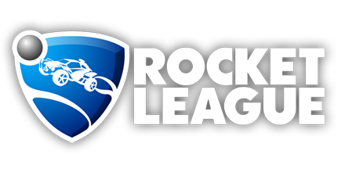
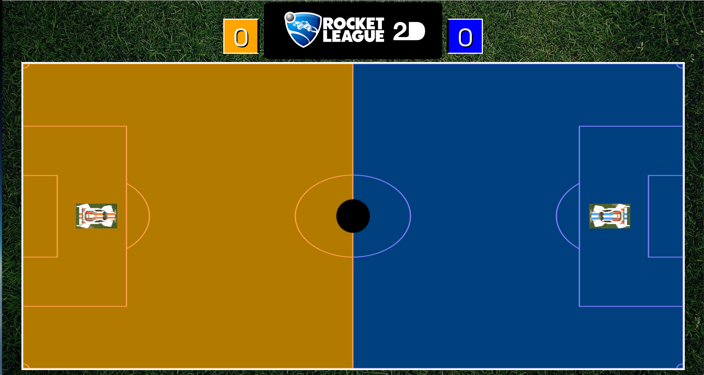

 
 

# ROCKET LEAGUE 2D v0.9
##(https://github.com/skempisty/rocket_league_2d)
### Author: Stephen Kempisty

==========

## Introduction

Welcome to Rocket League 2D! Your favorite rocket powered battle car socCAR game in top down form! Find the full game online for free at:

<a>http://skempisty.github.io/rocket_league_2d/</a>

Development is ongoing, and many more features such as curved arena corners, boost pickups, multiple car models, and player registration/rankings are coming soon!

## Controls

#### Player 1 (Orange):
- W = Accelerate
- S = Brake/Reverse
- A = Turn Left
- D = Turn Right

#### Player 2 (Blue):
- Up Arrow = Accelerate
- Down Arrow = Brake/Reverse
- Left Arrow = Turn Left
- Right Arrow = Turn Right

## Game Flow

Begin playing Rocket League 2D by pressing the start button after the game loads. 

The game timer starts at 5:00. Try to score as many goals against your opponent as you can in that time to win the game! Simple and fun!

 
## Technologies

Rocket League 2D runs completely in the browser with no installation required. Technologies used in production include:
&nbsp;

- HTML
- CSS 
- Javascript
- jQuery
- Canvas

## Design

The general design approach taken for Rocket League 2D (RL2d) started with a focus on the minimum viable product (MVP). Coding basic features such as movement, collision detection, basic physics, scoring, and a timer was the first goal. 

Once a MVP had been completed, some advanced features such as sound effects, car models, and refined collision physics could be completed.

RL2d development emphasized throwbacks to the original game on Ps4/Xbox One/PC. Sound effects come straight from Rocket League's sound files, and the aesthetic design was based on the aesthetics of the original Rocket League.    

## Get Started

No installation is required for RL2d! Simply navigate to the following link and play away!

<a>http://skempisty.github.io/rocket_league_2d/</a>

If you would like to contribute to further development of RL2d, feel free to fork this repository. Permission to snoop around in the code is given whole-heartedly!

## Next Steps
There are many exciting features planned that unfortunately did not make it into the release version of RL2d. Please check back for future versions. New features such as the following are coming soon!

- Car to Car collisions
- Curved arena corners
- Ball graphic and rolling animation
- Boost pickups and usage
- Improved goal interaction/animation
- Improved/varied car models
- Player registration
- Player rankings
 
